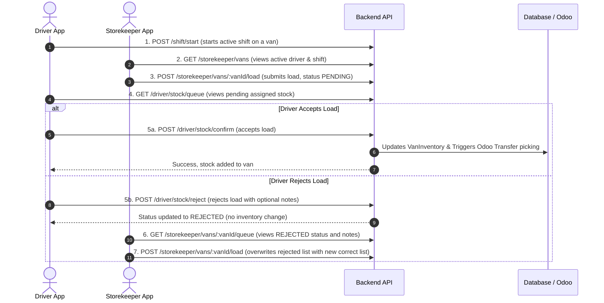

# Jazeera Storekeeper & Driver Stock Load API Guide

This document describes the API endpoints and workflow for the **Storekeeper Mobile App** and the **Driver Confirmation Flow** for stock loading.

---

## Complete Stock Loading Workflow



---

## 1. Authentication
Both the Storekeeper and Driver log in using the same authentication endpoint.

* **Endpoint**: `POST /api/v1/auth/login`
* **Request Body**:
  ```json
  {
    "email": "storekeeper@jazeera.com",
    "password": "password123"
  }
  ```
* **Response**:
  ```json
  {
    "success": true,
    "data": {
      "token": "eyJhbGciOi...",
      "user": {
        "id": "abc-123-uuid",
        "name": "Warehouse Lead",
        "email": "storekeeper@jazeera.com",
        "role": "STORE_KEEPER"
      }
    }
  }
  ```

---

## 2. Storekeeper App Endpoints

All storekeeper endpoints require the bearer token in the `Authorization` header and are restricted to users with roles `STORE_KEEPER`, `ADMIN`, or `MANAGER`.

### A. List Vans
Used to list all active vans in the depot. If a van has an active driver/shift, the details are populated.

* **Method**: `GET`
* **Endpoint**: `/api/v1/storekeeper/vans`
* **Response**:
  ```json
  {
    "success": true,
    "data": [
      {
        "id": "van-uuid-111",
        "plateNumber": "DXB-A-12345",
        "model": "Toyota HiAce",
        "isActive": true,
        "activeDriver": {
          "id": "driver-uuid-222",
          "name": "Ahmed Al-Rashid"
        },
        "activeShift": {
          "id": "shift-uuid-333",
          "startedAt": "2026-06-17T09:00:00.000Z"
        }
      }
    ]
  }
  ```

### B. Get Van Queue Status
Get the real-time status of the items assigned to a van for the active shift.

* **Method**: `GET`
* **Endpoint**: `/api/v1/storekeeper/vans/:vanId/queue`
* **Response**:
  ```json
  {
    "success": true,
    "data": [
      {
        "id": "queue-item-uuid",
        "shiftId": "shift-uuid-333",
        "productId": "product-uuid-444",
        "quantity": 25,
        "confirmed": false,
        "status": "PENDING",
        "notes": null,
        "scannedAt": "2026-06-17T09:05:00.000Z",
        "product": {
          "id": "product-uuid-444",
          "name": "Mineral Water 500ml",
          "sku": "WAT-500",
          "unit": "pcs",
          "imageUrl": null
        }
      }
    ],
    "meta": {
      "driver": {
        "id": "driver-uuid-222",
        "name": "Ahmed Al-Rashid"
      },
      "shiftId": "shift-uuid-333"
    }
  }
  ```

### C. Assign Van Load
Assign/send a stock load to a van. 
> **Important**: This endpoint transactionally overwrites/deletes any unconfirmed (`PENDING` or `REJECTED`) items for the current active shift and sets the new list as `PENDING`. It will block submission if items have already been accepted/confirmed.

* **Method**: `POST`
* **Endpoint**: `/api/v1/storekeeper/vans/:vanId/load`
* **Request Body**:
  ```json
  {
    "products": [
      {
        "productId": "product-uuid-444",
        "quantity": 50
      }
    ]
  }
  ```
* **Response**:
  ```json
  {
    "success": true,
    "message": "Stock load assigned successfully"
  }
  ```

---

## 3. Driver App Endpoints

### A. Get Stock Queue (Pending Load)
Fetch the pending items loaded by the storekeeper to display to the driver.

* **Method**: `GET`
* **Endpoint**: `/api/v1/driver/stock/queue`
* **Response**: Same array structure as the storekeeper queue list (only returns unconfirmed items).

### B. Confirm Stock Load (Accept)
Confirm and accept the stock load list. This increments the van's inventory and pushes the transfer Picking to Odoo.

* **Method**: `POST`
* **Endpoint**: `/api/v1/driver/stock/confirm`
* **Response**:
  ```json
  {
    "success": true,
    "message": "1 items loaded into van successfully"
  }
  ```

### C. Reject Stock Load
Reject the stock load assignment (e.g., if quantities in the van don't match the list). This moves the queue items to `REJECTED` status so the storekeeper can correct it.

* **Method**: `POST`
* **Endpoint**: `/api/v1/driver/stock/reject`
* **Request Body**:
  ```json
  {
    "notes": "Quantity is incorrect, only received 40 instead of 50"
  }
  ```
* **Response**:
  ```json
  {
    "success": true,
    "message": "Stock load rejected successfully"
  }
  ```

### D. Get Van Inventory
View current stocks loaded inside the van.

* **Method**: `GET`
* **Endpoint**: `/api/v1/driver/van/inventory`
* **Response**:
  ```json
  {
    "success": true,
    "data": {
      "van": {
        "id": "van-uuid-111",
        "plateNumber": "DXB-A-12345"
      },
      "items": [
        {
          "id": "inventory-item-uuid",
          "productId": "product-uuid-444",
          "quantity": 50,
          "name": "Mineral Water 500ml",
          "sku": "WAT-500",
          "unit": "pcs",
          "priceRetail": 1.5,
          "imageUrl": null
        }
      ],
      "totalItems": 1,
      "totalUnits": 50
    }
  }
  ```

---

## 4. Newly Added Storekeeper Endpoints

### A. Get Dashboard Statistics
Get live counts for the storekeeper dashboard.

* **Method**: `GET`
* **Endpoint**: `/api/v1/storekeeper/dashboard`
* **Response**:
  ```json
  {
    "success": true,
    "data": {
      "warehouseStockCount": 1250,
      "waitingVanCount": 3,
      "damagedStockCount": 12
    }
  }
  ```

### B. Get Warehouse Stock
Get a list of all products along with their live stock quantity in the main warehouse.

* **Method**: `GET`
* **Endpoint**: `/api/v1/storekeeper/warehouse-stock`
* **Query Parameters**:
  - `q` (optional): search string to filter by product name or SKU
  - `page` (optional): page number (default: `1`)
  - `limit` (optional): items per page (default: `20`)
  - `lowStockThreshold` (optional): threshold to determine low stock (default: `10`)
* **Response**:
  ```json
  {
    "success": true,
    "data": {
      "totalSkuCount": 42,
      "lowStockCount": 5,
      "outOfStockCount": 2,
      "products": [
        {
          "id": "product-uuid-444",
          "name": "Mineral Water 500ml",
          "sku": "WAT-500",
          "imageUrl": "data:image/png;base64,...",
          "totalStock": 150
        }
      ]
    },
    "meta": {
      "total": 42,
      "page": 1,
      "limit": 20,
      "totalPages": 3
    }
  }
  ```

### C. Search Driver or Van
Search for drivers (and their corresponding vans) and check if they have active shifts and loaded stock.

* **Method**: `POST`
* **Endpoint**: `/api/v1/storekeeper/drivers/search`
* **Request Body**:
  ```json
  {
    "q": "Ahmed" // search by driver name or van number
  }
  ```
* **Response**:
  ```json
  {
    "success": true,
    "data": [
      {
        "driverId": "driver-uuid-222",
        "driverName": "Ahmed Al-Rashid",
        "vanNumber": "DXB-A-12345",
        "assignedDate": "2026-06-17T09:00:00.000Z",
        "totalLoadedItems": 50,
        "status": "PENDING" // status can be: PENDING, ACCEPTED, REJECTED, or NONE (no active shift)
      }
    ]
  }
  ```

### D. Get Today's Damaged Stock Report
Fetch the list of all damaged stock items reported on a specific date.

* **Method**: `GET`
* **Endpoint**: `/api/v1/storekeeper/damaged-stock`
* **Query Parameters**:
  - `date` (optional): filter by date (e.g. `2026-06-23`, defaults to today)
* **Response**:
  ```json
  {
    "success": true,
    "data": {
      "reportDate": "2026-06-23",
      "totalDamageProductCount": 12,
      "items": [
        {
          "adjustmentId": "adj-uuid-999",
          "productId": "product-uuid-444",
          "productName": "Mineral Water 500ml",
          "sku": "WAT-500",
          "productImage": null, // URL or base64 data of product thumbnail
          "proofImage": "https://example.com/receipts/proof.jpg", // Photo proof of damage
          "quantity": 5,
          "vanNumber": "DXB-A-12345",
          "driverName": "Ahmed Al-Rashid",
          "uploadedAt": "2026-06-23T08:15:00.000Z",
          "reason": "Bottle leaking"
        }
      ]
    }
  }
  ```

### E. Report Damaged Stock (Submit Damage Report)
Report damaged stock in a van, which decrements the van inventory, records a stock adjustment locally, and logs it in Odoo.

* **Method**: `POST`
* **Endpoint**: `/api/v1/storekeeper/damaged-stock`
* **Request Body**:
  ```json
  {
    "productId": "product-uuid-444",
    "vanId": "van-uuid-111",
    "quantity": 3,
    "reason": "DAMAGE", // DAMAGE, EXPIRY, THEFT, OTHER
    "notes": "Box crushed",
    "imageUrl": "https://example.com/proof.jpg" // Optional proof image URL
  }
  ```
* **Response**:
  ```json
  {
    "success": true,
    "message": "Report submitted successfully"
  }
  ```

### F. Get Van Stock Reconciliation
Get a product-by-product breakdown of loaded, sold, damaged, and balance (remaining) stock for a van's active shift.

* **Method**: `GET`
* **Endpoint**: `/api/v1/storekeeper/vans/:vanId/reconciliation`
* **Response**:
  ```json
  {
    "success": true,
    "data": {
      "summary": {
        "loadedStock": 100,
        "soldStock": 40,
        "damagedStock": 5,
        "balanceStock": 55
      },
      "products": [
        {
          "productId": "product-uuid-444",
          "productName": "Mineral Water 500ml",
          "sku": "WAT-500",
          "imageUrl": null,
          "loadedStock": 50,
          "soldStock": 20,
          "damagedStock": 2,
          "balanceStock": 28
        }
      ]
    }
  }
  ```

### G. Submit Stock Reconciliation
Manually log sold and/or damaged quantities for a product on a van, updating the van inventory.

* **Method**: `POST`
* **Endpoint**: `/api/v1/storekeeper/vans/:vanId/reconciliation`
* **Request Body**:
  ```json
  {
    "productId": "product-uuid-444",
    "soldQuantity": 5, // Quantity sold (optional, default 0, will write cash sale)
    "damagedQuantity": 2 // Quantity damaged (optional, default 0, will write stock adjustment)
  }
  ```
* **Response**:
  ```json
  {
    "success": true,
    "message": "Stock updated successfully"
  }
  ```

---

## Sharing & Testing Steps

1. **Share the Postman Collection**:
   - Provide the file [jazeera-storekeeper.postman_collection.json](file:///c:/Users/Zahid/OneDrive/Desktop/syg/jazeera-backend/jazeera-storekeeper.postman_collection.json) to the developer.
   - They can import this directly in Postman (`File -> Import`).
2. **Setup Environments in Postman**:
   - Set the `base_url` variable to match the deployed server or local server (e.g., `http://localhost:3000`).
   - Run the login endpoints to retrieve tokens, and paste them into variables `storekeeper_jwt_token` and `driver_jwt_token`.
3. **Execute Flow**:
   - The developer can follow the Sequence Diagram workflow to verify step-by-step functionality.
